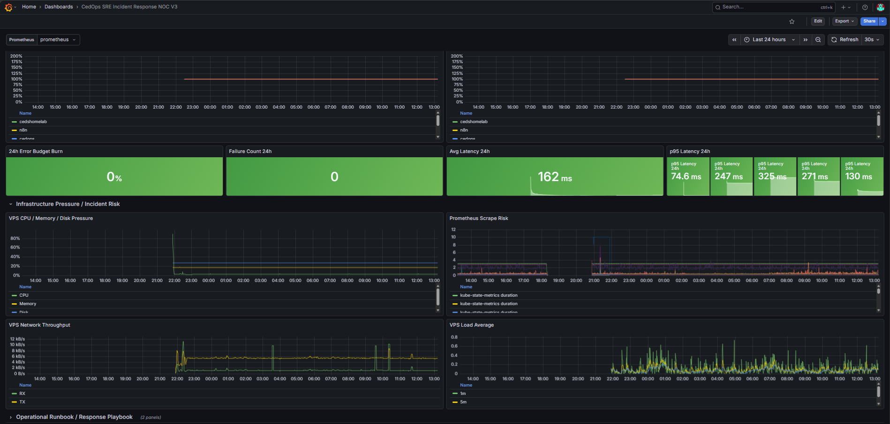
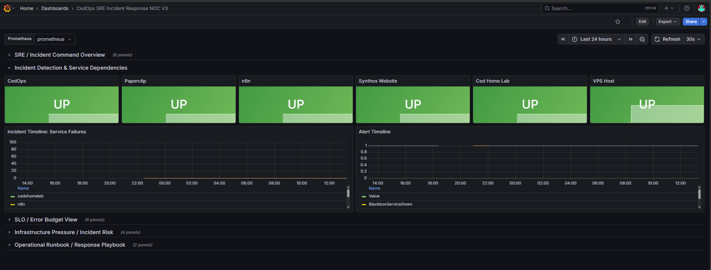
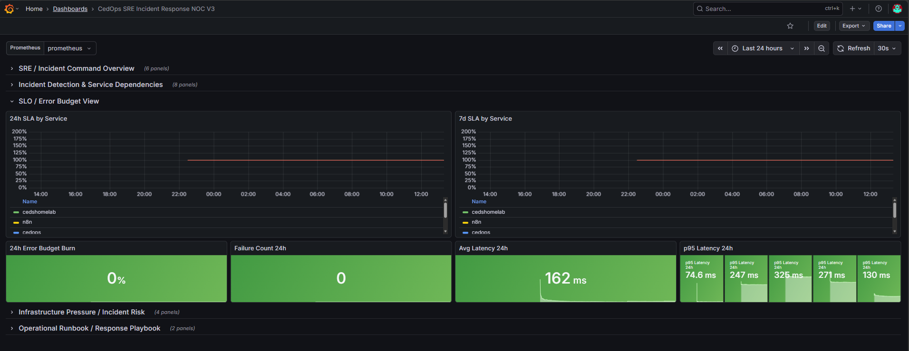
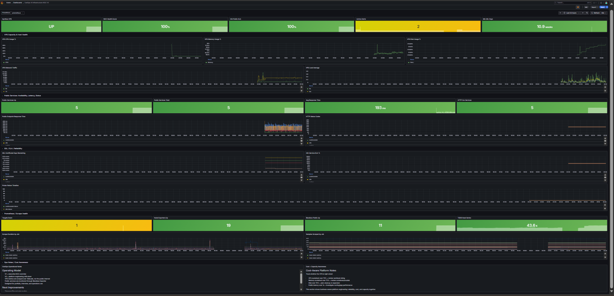
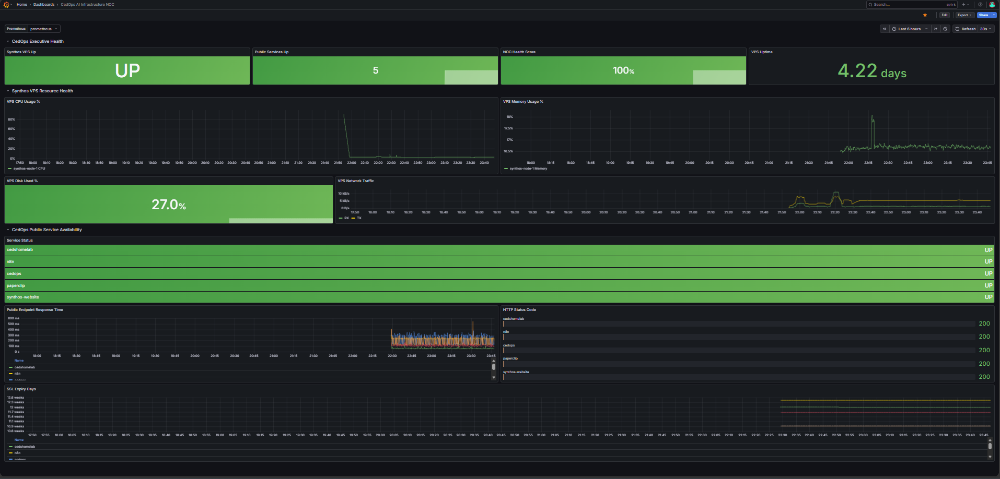

# 🤖 CedOps AI Infrastructure Operations NOC

> A live AI operations platform running on Hetzner VPS 8 autonomous agents orchestrated by Paperclip, monitored in real time by Prometheus (hosted on Proxmox homelab) scraping over Tailscale, visualized in a Grafana NOC dashboard.

[](https://noc.chasedumphord.com)
[](https://paperclip.synthossystems.com)
[](https://synthossystems.com)
[](https://chasedumphord.com)
[](#ai-agent-roster)
[](#infrastructure-layer)
[](#observability--noc)

---

## NOC Dashboard

CedOps dashboards are intentionally versioned to demonstrate increasing operational maturity from foundational observability to SRE style incident response and reliability engineering.

### V3  Current (SRE / Incident Response)

[](docs/screenshots/dashboard_v3-overview.png)

#### Incident Response & Dependencies

[](docs/screenshots/dashboard_v3-incidents.png)

#### Reliability / SLO Monitoring

[](docs/screenshots/dashboard_v3-slo.png)

---

### V2  Operational Reliability

[](docs/screenshots/dashboard_v2.png)

---

### V1  Foundational Observability

[](docs/screenshots/dashboard_v1.png)

> **Live:** Public services monitored every 30 seconds · Prometheus scraping via Tailscale · Grafana visualizing hybrid infrastructure health

---

## Overview

CedOps is a **production-style AI operations platform** built to simulate a real world Platform Engineering and AI Infrastructure environment.

The VPS stack runs on Hetzner and is monitored by Prometheus hosted on a Proxmox homelab node, communicating over a private Tailscale network with everything visualized in a live Grafana NOC dashboard.

The platform combines:

* **Paperclip** — AI Agent Orchestration Platform managing 8 autonomous agents
* **SugeBot** — Hermes AI agent deployed as Telegram Operations Assistant (CTO/Ops role)
* **n8n** — Automation platform for workflow execution and inter-service routing
* **OpenRouter** — AI model gateway serving as the LLM backbone for all agents
* **Prometheus** — Hosted on Proxmox homelab, scraping VPS services over Tailscale
* **Grafana** — Full observability NOC dashboard visualizing the entire stack in real-time
* **Nginx Proxy Manager** — Reverse proxy + SSL management across all services
* **Docker + Portainer** — Container infrastructure and management layer

---

## Architecture Overview

```text
                        Internet
                            │
              ┌─────────────┴─────────────┐
              │      Cloudflare Edge       │
              │   DNS · Tunnels · Proxy    │
              └─────────────┬─────────────┘
                            │
              ┌─────────────▼─────────────┐
              │       Hetzner VPS          │
              │    synthos-node-1          │
              │                           │
              │  ┌──────────────────────┐ │
              │  │  Nginx Proxy Manager  │ │
              │  │  Reverse Proxy / SSL  │ │
              │  └──────────┬───────────┘ │
              │             │             │
              │  ┌──────────▼───────────┐ │
              │  │      Portainer        │ │
              │  │  Docker Management    │ │
              │  └──────────┬───────────┘ │
              │             │             │
              │  ┌──────────▼──────────────────────────────────┐ │
              │  │              CedOps Platform                  │ │
              │  │                                               │ │
              │  │  ┌─────────────┐   ┌──────────────────────┐ │ │
              │  │  │  Paperclip  │   │       SugeBot         │ │ │
              │  │  │ AI Orch.    │   │   Telegram Ops        │ │ │
              │  │  │  8 Agents   │   │   (Hermes Agent)      │ │ │
              │  │  └──────┬──────┘   └──────────┬───────────┘ │ │
              │  │         │                      │             │ │
              │  │  ┌──────▼──────┐   ┌──────────▼───────────┐ │ │
              │  │  │ OpenRouter  │   │         n8n           │ │ │
              │  │  │ AI Gateway  │   │     Automation        │ │ │
              │  │  └─────────────┘   └──────────────────────┘ │ │
              │  └───────────────────────────────────────────────┘ │
              │              ▲ Node Exporter + Blackbox             │
              └──────────────┼──────────────────────────────────────┘
                             │ Tailscale (encrypted private tunnel)
              ┌──────────────┴──────────────────────┐
              │         Proxmox Homelab              │
              │                                      │
              │  ┌─────────────┐  ┌───────────────┐ │
              │  │ Prometheus  │  │    Grafana     │ │
              │  │ Metrics     │→ │  NOC Dashboard │ │
              │  │ Collection  │  │                │ │
              │  └─────────────┘  └───────────────┘ │
              └─────────────────────────────────────┘
```

---

## AI Agent Roster

All agents run inside **Paperclip**  the AI Agent Orchestration Platform at `paperclip.synthossystems.com`.

| Agent                   | Role                                                                   | Status |
| ----------------------- | ---------------------------------------------------------------------- | ------ |
| **Suge**                | CTO / Operations (Hermes Agent) — also deployed as SugeBot on Telegram | ✅ Live |
| **CEO**                 | Executive decision-making and strategic oversight                      | ✅ Live |
| **ClaudeCoder**         | Software engineering and code generation                               | ✅ Live |
| **Engineer**            | Infrastructure and systems engineering                                 | ✅ Live |
| **Marketing**           | Marketing strategy and content                                         | ✅ Live |
| **Offer Builder Agent** | Sales offer generation and pipeline                                    | ✅ Live |
| **Research**            | Market research and intelligence gathering                             | ✅ Live |
| **Sales Agent**         | Lead qualification and outreach                                        | ✅ Live |

> **Suge** serves dual duty the primary Hermes style ops agent inside Paperclip, and the external-facing **SugeBot** on Telegram for real-time operational commands.

---

## Infrastructure Layer

All services run on a **Hetzner VPS** (`synthos-node-1`) behind Cloudflare Tunnels with zero exposed ports.

| Service                 | Role                            | URL                      |
| ----------------------- | ------------------------------- | ------------------------ |
| **VPS / Portainer**     | Docker container management     | Internal                 |
| **Nginx Proxy Manager** | Reverse proxy + SSL termination | Internal                 |
| **Homepage**            | CedOps command center dashboard | `ops.synthossystems.com` |
| **Synthos Website**     | Business-facing website         | `synthossystems.com`     |
| **Ced's Home Lab**      | Homelab / Portfolio platform    | `cedshomelab.com`        |

**Traffic Flow:**

```text
Internet → Cloudflare Edge → Tunnel → Nginx Proxy Manager → Docker Services
```

---

## Observability & NOC

Prometheus runs on the **Proxmox homelab** and scrapes the Hetzner VPS over a **Tailscale private tunnel** keeping metrics collection completely off the public internet.

Grafana visualizes everything in the live NOC dashboard.

### Executive Health Panel

* **Synthos VPS Status**  UP/DOWN state with instant alerting
* **Public Services Up**  count of healthy endpoints (target: 5/5)
* **NOC Health Score**  composite platform health percentage
* **VPS Uptime**  continuous uptime tracking in days

### VPS Resource Health

* CPU Usage %  `synthos-node-1` CPU time series
* Memory Utilization %  real-time memory pressure
* Disk Used %  infrastructure capacity monitoring
* Network Traffic RX/TX bandwidth graphs (30s refresh)

### Public Service Availability

Tracked via **Blackbox Exporter** HTTP probes.

| Service         | Endpoint                     | Status |
| --------------- | ---------------------------- | ------ |
| cedshomelab     | cedshomelab.com              | ✅ UP   |
| n8n             | n8n.synthossystems.com       | ✅ UP   |
| cedops          | ops.synthossystems.com       | ✅ UP   |
| paperclip       | paperclip.synthossystems.com | ✅ UP   |
| synthos-website | synthossystems.com           | ✅ UP   |

### Reliability Metrics

* HTTP Status Codes per endpoint
* Public Endpoint Response Time
* SSL Expiry Days tracking
* Service availability monitoring
* SLO / SLA visibility
* Incident timeline monitoring

---

## Security Architecture

CedOps is designed with **zero public infrastructure exposure**.

| Control                  | Implementation                                              |
| ------------------------ | ----------------------------------------------------------- |
| No open ports            | Cloudflare Tunnel handles all ingress                       |
| Private metrics pipeline | Prometheus → Tailscale → VPS; never public                  |
| SSL everywhere           | NPM handles termination for all services                    |
| Container isolation      | Docker network segmentation via Portainer                   |
| Secret management        | No secrets in this repo handled via environment variables |

---

## Repository Structure

```text
cedops-ai-infrastructure-noc/
│
├── docs/
│   ├── architecture/
│   ├── screenshots/
│   │   ├── dashboard_v1.png
│   │   ├── dashboard_v2.png
│   │   ├── dashboard_v3-overview.png
│   │   ├── dashboard_v3-incidents.png
│   │   └── dashboard_v3-slo.png
│   └── sops/
│
├── grafana/
│   ├── cedops-ai-infrastructure-noc-v1.json
│   ├── cedops-ai-infrastructure-noc-v2.json
│   └── cedops-sre-incident-response-v3.json
│
├── Prometheus/
│   ├── prometheus-example.yml
│   └── blackbox-targets-example.yml
│
├── diagrams/
│   └── cedops-architecture.mmd
│
└── README.md
```

> **Note:** Prometheus and Blackbox configs are sanitized for public sharing. Production configs are managed privately and never committed to this repo.

---

## Stack

| Layer                | Technology                                     |
| -------------------- | ---------------------------------------------- |
| **Compute**          | Hetzner VPS (synthos-node-1)                   |
| **Containers**       | Docker + Portainer                             |
| **Reverse Proxy**    | Nginx Proxy Manager                            |
| **DNS & Tunnels**    | Cloudflare                                     |
| **Private Network**  | Tailscale (Proxmox ↔ VPS metrics tunnel)       |
| **AI Orchestration** | Paperclip                                      |
| **AI Gateway**       | OpenRouter                                     |
| **Automation**       | n8n                                            |
| **Ops Agent**        | SugeBot (Hermes / Telegram)                    |
| **Metrics**          | Prometheus + Node Exporter + Blackbox Exporter |
| **Visualization**    | Grafana                                        |
| **Virtualization**   | Proxmox VE                                     |

---

## What's Built

### V1 Dashboard — Foundational Observability

* [x] VPS UP/DOWN status panel
* [x] Public service availability monitoring
* [x] VPS resource health (CPU, Memory, Disk, Network)
* [x] HTTP status code monitoring
* [x] Endpoint response time tracking
* [x] SSL certificate monitoring
* [x] Cross-environment scraping via Tailscale

### V2 Dashboard — Operational Reliability

* [x] SSL expiration tracking
* [x] Service reliability scoring
* [x] Public service availability metrics
* [x] Latency monitoring
* [x] Capacity awareness
* [x] Prometheus scrape visibility
* [x] Infrastructure health scoring

### V3 Dashboard — SRE / Incident Response

* [x] Incident command overview
* [x] Service dependency monitoring
* [x] Alert timeline visibility
* [x] SLO/SLA monitoring
* [x] Error budget awareness
* [x] Incident response workflow
* [x] Infrastructure pressure detection
* [x] Reliability engineering metrics

---

## Roadmap

### V4 — AI-Assisted Operations

* [ ] AI Incident Detection
* [ ] Automated Remediation (n8n workflows triggered by alerts)
* [ ] Telegram alert integration via SugeBot
* [ ] Discord notifications
* [ ] Paperclip agent telemetry dashboard
* [ ] Agent execution analytics
* [ ] Token spend / cost observability
* [ ] Multi-environment monitoring (Homelab + VPS unified NOC)

---

## Author

**Chase Dumphord**
DevOps and Cloud Infrastructure Engineer | Platform Engineering | AI Infrastructure | Observability

[](https://www.linkedin.com/in/chase-dumphord/)
[](https://github.com/ced4568)
[](https://noc.chasedumphord.com)
[](https://chasedumphord.com)

---

## Related Repos

| Repo                                                          | Description                                                        |
| ------------------------------------------------------------- | ------------------------------------------------------------------ |
| [ceds-homelab](https://github.com/ced4568/ceds-homelab)       | 6 node Proxmox cluster + 12 node K3s + full homelab infrastructure |
| [ced-k3s-homelab](https://github.com/ced4568/ced-k3s-homelab) | 12 node Raspberry Pi K3s cluster detail                            |
| [ceds-observability-stack](https://github.com/ced4568/ceds-observability-stack) | Observability stack configs and dashboards          |
| [ceds-noc](https://github.com/ced4568/ceds-noc)               | Custom-built public NOC status page                                |
